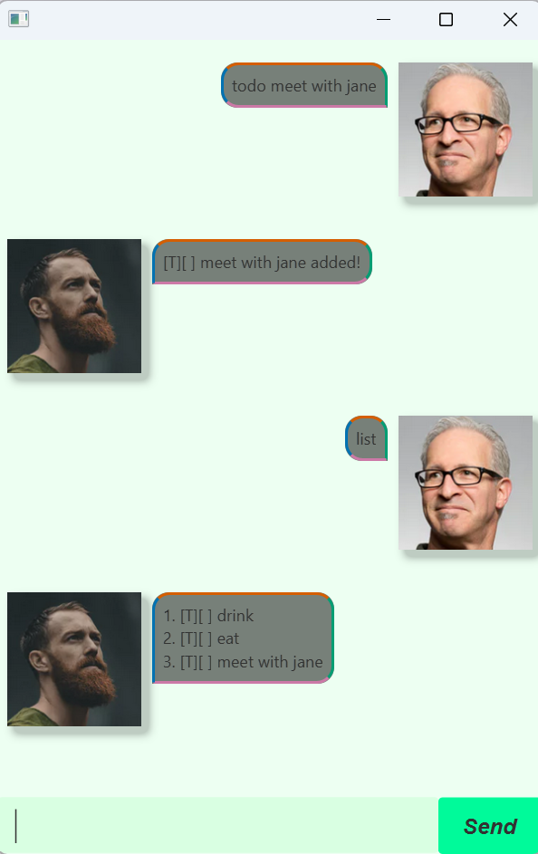

# Janet User Guide

Welcome to the Janet user guide! Janet is a desktop application that helps you track your everyday tasks.

This user guide provides in-depth documentation on how you can install, configure, and set up your own Janet program. 

**This guide is targeted for you if you**:
1. are handy with command-line interfaces;
2. want to quickly set up Janet; 
3. want to familiarize yourself fully with Janet.

## Table of Contents
* [Quick Start](#quick-start)
* [Features](#features)
* [FAQ](#faq)
* [Command Cheatsheet](#a-quick-and-easy-cheatsheet-to-use-janet)

## Quick Start
1. **Ensure that Java `25` or later is installed on your computer**.
2. Download the latest `.jar` file from [here](https://github.com/nuggettowin/ip/releases)
3. Copy the file to the folder you want to use as the home folder for your Janet application.
4. Open a terminal, `cd` to the folder containing the `.jar` file, and run `java -jar janet.jar`  
➡️ A GUI similar to the one above should appear in a few seconds. Note how the app contains some sample data.
5. Type a command in the command box and press <kbd>Enter</kbd> to execute it. For example, type `list` and press <kbd>Enter</kbd> to list current tasks.   
➡️ You should see your text and Janet's response (`No tasks listed!`) in the chat window.

## Features
> **📍IMPORTANT!** 
> * Words in `UPPER_CASE` are the parameters to be supplied by the user.  
> * Janet is **case-sensitive**. Commands in a different case won't be recognized.
> * Extra parameters for commands that take no parameters, like `list`, will be ignored.

### Listing tasks: `list`
Displays the list of tasks, if any, currently stored by Janet.

Format: `list`

---

### Adding Tasks
Adding tasks is simple; all tasks have the same base format for doing so.    

Format: `TASK_TYPE TASK_LABEL`
* Adds a task with a `TASK_LABEL` description.

**Janet will not allow you to add a task with the same `TASK_TYPE` and `TASK_LABEL` as another task in the program**.   
*This is because it's considered a duplicate*.

  

#### <u>Adding a todo task:</u> `todo`
Adds a task that has no deadline or period.  

Format: `todo TASK_LABEL`

*Examples*:  
* `todo eat`
* `todo meet Sarah`

  

#### <u>Adding a deadline task:</u> `deadline`
Adds a task that has a deadline.

Format: `deadline TASK_LABEL /by DATE`

**`DATE` must be in the format `yyyy-mm-dd`**

*Examples*:
* `deadline do homework /by 2025-12-03`
* `deadline finish poetry /by 1847-12-03`

  

#### <u>Adding an event task:</u> `event`
Adds a task that lasts for a specified period.

Format: `event TASK_LABEL /from DATE /to`

**`DATE` must be in the format `yyyy-mm-dd`**

*Examples*:
* `deadline eat lunch /from 2025-12-03 /to 2026-12-03` 
* `deadline create planes /from 1847-12-03 /to 2026-12-03`
 
   

---

### Deleting a task: `delete`
Deletes a task, if it exists, based on their current sorted position in the list.  

Format: `delete INDEX`

*Example*:  
`delete 1` Deletes the first item on the list.

---

### Finding tasks: `find`
Finds tasks, if any, that match the given phrase.

Format: `find PHRASE`

*Example*:  
`find read` Find all tasks whose description has `read` at any part of the description. Matches `read book`, `ready`, etc.

---

### Marking a task: `mark`
Marks a task, if it exists, as completed based on their current sorted position in the list.

Format: `mark INDEX`

*Example*:  
`mark 1` Marks the first item on the list as complete.  

---

### Sorting tasks: `sort`
Sorts tasks based on the provided sort type.

Format: `sort SORT_TYPE`

*Examples:*  
`sort default` Sorts tasks by their insertion order in the list.  
`sort label` Sorts tasks by alphabetical order based on their description.

---

### Exiting program: `bye`
Exits the program.

Format: `bye`

## FAQ
**Q**: What happens to my tasks after I close Janet?  
**A**: **Janet stores your tasks in a `.txt` file and loads this up for you when you reopen the program**. This is located in `/data/tasks.txt` in your app directory; Janet will save to this file every time it's modified.
> **📝Note!**  
> You can manually edit the `tasks.txt` file to add in new tasks.
**Make sure to format your edits accordingly though, or Janet won't load your tasks.**

## A quick and easy cheatsheet to use Janet

|Action|Format, Examples|
|------|----------------|
|List all tasks|Format: `list` Example: `list`|
|Add a todo|Format: `todo TASK_LABEL` Example: `todo buy groceries`|
|Add a deadline|Format: `deadline TASK_LABEL /by DATE` Example: `deadline submit report /by 2026-09-30`|
|Add an event|Format: `event TASK_LABEL /from DATE /to DATE` Example: `event project meeting /from 2026-09-20 /to 2026-09-21`|
|Delete a task|Format: `delete INDEX` Example: `delete 2`|
|Find tasks|Format: `find PHRASE` Example: `find report`|
|Mark a task as completed|Format: `mark INDEX` Example: `mark 1`|
|Sort tasks by insertion order|Format: `sort default` Example: `sort default`|
|Sort tasks alphabetically|Format: `sort label` Example: `sort label`|
|Exit Janet|Format: `bye` Example: `bye`|
